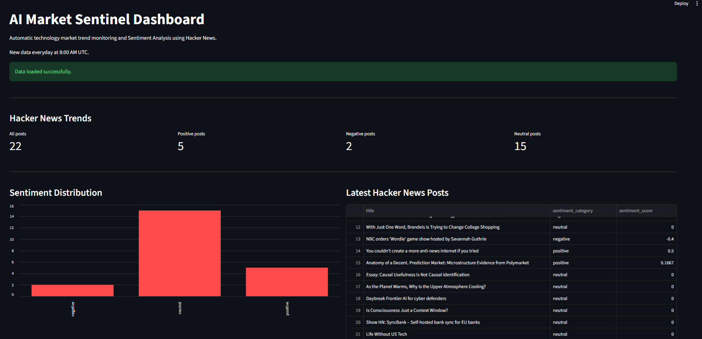

# 📊 AI-Market Sentinel: Zautomatyzowany Pipeline ETL & Dashboard

Kompleksowy system klasy Enterprise do monitorowania trendów technologicznych. Projekt realizuje pełny proces **ETL** (Extract, Transform, Load), wykorzystuje **Sztuczną Inteligencję** do analizy sentymentu i jest w pełni zautomatyzowany w chmurze.

 ## 🚀 O Projekcie

Projekt został zbudowany w ciągu 7 dni jako demonstracja umiejętności z zakresu Data Engineeringu, pracy z chmurą AWS oraz automatyzacji procesów. System codziennie pobiera najnowsze dyskusje technologiczne, ocenia ich wydźwięk biznesowy i wizualizuje dane.

### Kluczowe Funkcjonalności:
* **Extract:** Pobieranie danych w czasie rzeczywistym z Hacker News API.
* **Transform (AI/NLP):** Analiza sentymentu treści przy użyciu biblioteki TextBlob (rozpoznawanie pozytywnego/negatywnego wydźwięku).
* **Load:** Zapis przetworzonych danych do bazy PostgreSQL w chmurze AWS RDS.
* **Automatyzacja:** System bezobsługowy dzięki GitHub Actions (uruchamia się codziennie o 8:00 UTC).
* **Wizualizacja:** Interaktywny dashboard analityczny zbudowany w Streamlit.
* **Idempotentność:** Autorska logika zapobiegająca duplikowaniu danych w bazie.

## 🛠 Stack Technologiczny

* **Język:** Python 3.10
* **Baza Danych:** AWS RDS (PostgreSQL)
* **Chmura / CI/CD:** GitHub Actions
* **Biblioteki:** Pandas, Psycopg2, TextBlob, Requests, Streamlit
* **Bezpieczeństwo:** GitHub Secrets & .env

## 🏗 Architektura Systemu

1.  **GitHub Actions** wyzwala skrypt `main.py`.
2.  Skrypt pobiera dane z **Hacker News API**.
3.  Model **NLP** analizuje tekst i nadaje mu kategorię sentymentu.
4.  Dane trafiają do bazy **AWS RDS**.
5.  **Streamlit Dashboard** łączy się z bazą i generuje wykresy w czasie rzeczywistym.

## ⚙️ Instrukcja Uruchomienia

### 1. Lokalny Dashboard
Aby uruchomić dashboard na własnym komputerze:
```bash
pip install -r requirements.txt
streamlit run dashboard.py
```

### 2. Konfiguracja Zmiennych
Projekt wymaga pliku `.env` z następującymi kluczami:
`DB_HOST`, `DB_NAME`, `DB_USER`, `DB_PASSWORD`, `DB_PORT`.